# 🚀 **Balaji TV**

 

  

---

### 📊 **GitHub Analytics**

|  |  |
|:---:|:---:|

---

## 📌 Quick Navigation

- [About Me](#-about-me)
- [Education](#-education)
- [Projects](#-projects-completed)
- [Skills](#-technical-skills)
- [Certifications](#-certifications--courses)
- [Connect](#-connect-with-me)
- [GitHub Stats](#-github-analytics)

---

 

---

## 🛠️ Technical Skills

### 📱 **Frontend Development**

### 🖥️ **Backend Development**

### 🗄️ **Databases**

### 📊 **Data Science & Analysis**

### 🛠️ **Tools & Platforms**

---

## 📌 About Me

Aspiring IT professional and Computer Applications Master's student with a passion for **software development, database management, and data analysis**. Enthusiastic fresher eager to secure an entry-level position where I can leverage my technical skills and contribute to organizational success while gaining practical experience.

---

## 🎓 Education

| Degree | Institution | Status | Performance |
|--------|-------------|--------|-------------|
| **Master of Computer Applications** | Sir M. Visvesvaraya Institute of Technology, Bangalore | 🔄 Currently Pursuing | — |
| **Bachelor of Computer Applications** | Vidya Vikas First Grade College, Mysuru | ✅ Completed | **93.86%** |
| **Pre-University (PU)** | Vidya Vikas PU College, Mysore | ✅ Completed | **91%** |
| **SSLC** | Prashanth High School of Brilliance, K M Doddi | ✅ Completed | **85.6%** |

---

## 💼 Projects Completed

### 1. 🏥 **Liver Diseases Prediction Using Ensemble Technique**
- **Year:** 2025
- **Description:** Machine learning project implementing ensemble learning algorithms to predict liver diseases based on medical data
- **Tech Stack:** Python, Machine Learning, Data Analysis, scikit-learn
- **Key Features:**
  - Data preprocessing and feature engineering
  - Multiple ensemble models (Random Forest, Gradient Boosting, XGBoost)
  - Model comparison and evaluation
  - High accuracy prediction system

### 2. 🎓 **Online Course Registration System**
- **Year:** 2026
- **Description:** Full-stack web application for course registration and management
- **Tech Stack:** MongoDB, Express.js, Node.js, HTML, CSS, JavaScript
- **Key Features:**
  - User authentication & authorization
  - Course catalog with filtering
  - Registration management
  - Database-driven backend
  - Responsive UI design

### 3. 🚌 **EbussPass - Simple Web Page**
- **Year:** 2026
- **Description:** Web interface for bus pass booking and management system
- **Tech Stack:** HTML, CSS, JavaScript
- **Key Features:**
  - Clean, user-friendly interface
  - Bus pass selection and booking
  - Responsive design
  - Simple yet functional design

### 4. 🤖 **AI-Based Research Paper Summarizer**
- **Year:** 2026
- **Description:** An intelligent AI-powered platform to upload, summarize, analyze, and interact with academic research papers. Built with FastAPI + Next.js and powered by the Inception Labs Mercury API.
- **Tech Stack:** HTML, CSS, JavaScript → Next.js, Python → FastAPI, MongoDB, API Key
- **Key Features:**
  - PDF Upload – Drag-and-drop or browse to upload academic research papers (PDF format)
  - Automatic Text Extraction – Extracts text from PDFs using PyMuPDF with page count detection
  - Metadata Extraction – AI-powered extraction of authors, publication date, institution/foundation, journal, and DOI
  - Paper Listing & Search – View all uploaded papers with sorting by upload date
  - Bookmarking – Bookmark papers for quick access
  - Delete Papers – Remove papers and their associated data

### 5. 📊 **IPL Data Analysis**
- **Year:** 2026
- **Description:** A complete data analysis project that leverages R Programming (ggplot2, dplyr, readr) for backend statistical computation and an HTML/CSS/JS dashboard for interactive visualization — all driven dynamically from raw CSV data.

- **Tech Stack:** HTML5, CSS3, Vanilla JavaScript , R Programming
- **Key Features:**
  - Season Overview — Summary statistics (total matches, teams, seasons, toss trends)
  -  Match Details — Per-match results with season filtering
  - Team Statistics — Ranking by wins, matches played, win percentage
  - Player Performance — Top players ranked by Player of the Match (POTM) awards
  - Graph Gallery — Canvas-drawn charts (bar, pie, line, comparison) from live CSV data
  - Match Insights — Key findings: toss analysis, highest-scoring matches, closest finishes
  - Season Selector — Filter all views by any IPL season (2008–2025)
  - CSV-Driven — All stats computed dynamically from CSV — no hardcoded data
  - Lightbox Viewer — Click any graph to view full size

---

## 🏆 Certifications & Courses

| Certification | Issuer | Status |
|---------------|--------|--------|
| 🐍 **Python Basic** | HackerRank | ✅ Completed |
| 🗄️ **Introduction to MongoDB** | Great Learning | ✅ Completed |
| 🎨 **Front End Development - HTML** | SimpleELearn | ✅ Completed |
| 📊 **Introduction to R** | Skillup | ✅ Completed |
| 🗄️ **Infosys Springboard: SQL & HR Data** | Infosys | ✅ Completed |
| 🛠️ **Life Skills Training** | Magic Bus India Foundation | ✅ Completed |

---

## 💪 Core Competencies

### Hard Skills
- ✅ **Problem-Solving** — Ability to analyze technical issues and find efficient solutions
- ✅ **Full-Stack Development** — Front-end and back-end development capabilities
- ✅ **Database Design** — SQL and NoSQL database design and optimization
- ✅ **Data Analysis** — Statistical analysis and visualization
- ✅ **Software Development** — SDLC understanding and implementation

### Soft Skills
- 💬 **Communication** — Clear and effective communication with team members and stakeholders
- 🤝 **Teamwork** — Collaborative problem-solving and team collaboration
- ⚡ **Adaptability** — Quick to learn new technologies and adapt to changing environments
- 🎯 **Leadership** — Team coordination and project management
- 📚 **Continuous Learning** — Passion for self-improvement and skill development

---

## 🌍 Languages

- 🇬🇧 **English** — Professional
- 🇮🇳 **Kannada** — Native

---

## 🎯 Interests & Hobbies

- 📖 **Book Reading** — Exploring knowledge through literature
- 💻 **Programming & Coding** — Passionate about problem-solving through code
- 🏏 **Team Sports** — Cricket enthusiast and team player
- 📊 **Data Analytics** — Fascinated by insights from data
- 🚀 **Tech Innovation** — Interested in latest technology trends

---

## 🔗 Connect With Me

| Platform | Link |
|----------|------|
| 💼 **LinkedIn** | [linkedin.com/in/balaji-tv](https://www.linkedin.com/in/balaji-t-v-b68621256/) |
| 💻 **GitHub** | [github.com/BalajiTV04](https://github.com/BalajiTV04) |

---

## 📈 Featured Projects

### 🎯 Click to Explore More:

- [IPL Data Analysis Dashboard](https://github.com/BalajiTV04) — R + JavaScript analytics platform
- [Online Course Registration](https://github.com/BalajiTV04) — Full-stack web application
- [Liver Disease Prediction](https://github.com/BalajiTV04) — Machine Learning project

---

## 🚀 What I'm Currently Working On

- 🎓 **Master's in Computer Applications** at Sir M. Visvesvaraya Institute of Technology
- 📊 Building **Data Analytics Portfolio** projects
- 🔨 Expanding **Full-Stack Development** skills
- 📚 Learning **Advanced Machine Learning** techniques
- 🌐 Creating **Production-Ready Web Applications**

---

## 📝 Declaration

I hereby declare that the above information is true and correct to the best of my knowledge and belief. I take full responsibility for the accuracy of the details provided.

---

**Made with by Balaji TV**

© 2026 All Rights Reserved

---

**Last Updated:** June 2026
# My_resume